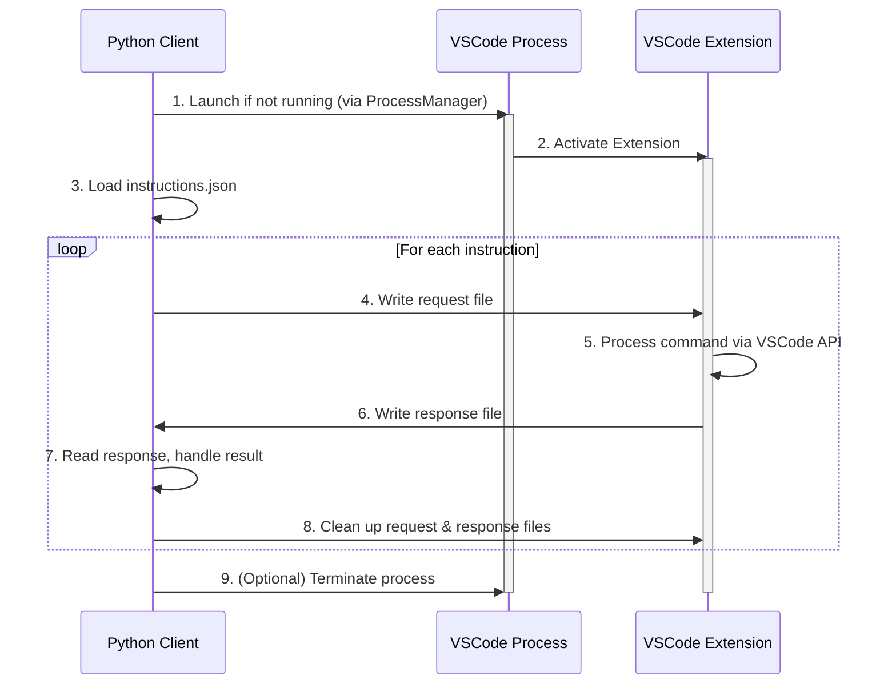

# Architecture Guide: VSCode Automation System

## 1. Core Philosophy: A Stable Client-Server Model

This system is designed based on a **strict client-server architecture** to ensure stability, scalability, and clear separation of concerns.

- **The Server (VSCode Extension):** The VSCode instance, managed by `VSCodeProcessManager`, acts as a **stateful, singleton server**. It is launched once and remains active to serve multiple requests. Its sole purpose is to provide a stable interface to the VSCode API.
- **The Client (Python Scripts):** Any external script (e.g., `simple_continuous_executor.py`) acts as a **client**. The client is responsible for orchestrating the overall workflow, managing business logic, and communicating with the server to perform VSCode-specific actions.

This model prevents the high overhead of launching a new VSCode process for each task and ensures that the extension's state is preserved across operations.

---

## 2. Component Responsibilities

### 2.1. VSCode Extension (Server-Side)

The extension's responsibilities are strictly limited to interacting with the VSCode API. It should be treated as a thin, stable wrapper.

**MUST:**

- **Expose a Command-Based API:** Listen for commands via a file-based IPC mechanism.
- **Interact with VSCode Internals:** Execute tasks using `vscode.window`, `vscode.commands`, `vscode.lm`, etc.
- **Return Actionable Results:** Report back the `success` or `error` status of a command, along with any relevant data (e.g., text generated by Copilot) or error messages.
- **Be Stateless (at the command level):** Each command should be atomic and self-contained. The extension should not retain memory of previous commands.

**MUST NOT:**

- **Contain Business Logic:** Do not implement complex workflows, loops, or decision-making.
- **Manage its Own Lifecycle:** The extension should not attempt to quit or restart itself. This is the client's responsibility.
- **Interact with External Systems:** Do not directly access databases, external APIs, or the file system outside of its designated IPC directories.

### 2.2. Python Client (Client-Side)

The client is the "brain" of the operation. It holds all the business logic and orchestrates the entire process.

**MUST:**

- **Manage the VSCode Lifecycle:** Use `VSCodeProcessManager` to ensure the singleton server is running.
- **Orchestrate the Workflow:** Read instructions, loop through tasks, and decide what to do next.
- **Construct and Send IPC Requests:** Create well-formed JSON request files and place them in the `requests` directory.
- **Handle IPC Responses:** Poll the `responses` directory, parse the JSON response, and handle timeouts.
- **Implement All Error Handling:** Manage retries, cold-start delays, and recovery from failed operations.
- **Process and Store Data:** Connect to databases, generate reports, and perform any data transformation.

**MUST NOT:**

- **Attempt Direct UI Interaction:** Do not use GUI automation tools to interact with the VSCode window. Rely solely on the IPC mechanism.

---

## 3. IPC Protocol Specification

Communication is asynchronous and file-based to ensure loose coupling.

### 3.1. Directory Structure

The system's operation revolves around a defined directory structure within `/tmp/copilot-evaluation/`:

- **/requests/**: The client places new task files here.
- **/responses/**: The server writes the outcome of tasks here.

### 3.2. Request/Response Format

- **Request (`requests/{request_id}.json`):**

    ```json
    {
      "request_id": "unique-identifier-string",
      "command": "nameOfCommandToExecute",
      "params": { ... }
    }
    ```

- **Response (`responses/{request_id}.json`):**

    ```json
    // On Success
    {
      "request_id": "unique-identifier-string",
      "status": "success",
      "data": { ... }
    }

    // On Error
    {
      "request_id": "unique-identifier-string",
      "status": "error",
      "error_message": "A descriptive error message."
    }
    ```

### 3.3. IPC Interaction Flow

The entire transaction is driven by the client. The server is a passive listener.

1. **Client:** Creates `requests/req-123.json`.
2. **Server:** Detects the new file, reads it, and begins processing.
3. **Server:** Upon completion, writes the result to `responses/req-123.json`.
4. **Client:** Polls for `responses/req-123.json`, reads it, and confirms the task is done.
5. **Client:** Deletes both `requests/req-123.json` and `responses/req-123.json` to complete the transaction.

This client-driven cleanup model is critical as it prevents race conditions and ensures that the client, which owns the overall workflow, is the sole authority on when a transaction is truly finished.

---

## 4. Key Python Components (Client-Side)

### 4.1. `VSCodeProcessManager`

- **Purpose:** Manages the lifecycle of the singleton VSCode process.
- **Key Functionality:**
  - `get_vscode_process()`: Checks if a VSCode process for the target workspace is already running. If not, it launches a new one.
  - **PID Management:** Correctly identifies the true VSCode process, ignoring wrapper scripts.
  - **Singleton Enforcement:** Ensures only one VSCode instance per workspace is used by the automation system.

### 4.2. `simple_continuous_executor.py`

- **Purpose:** The main entry point and orchestration engine for running a sequence of instructions.
- **Key Functionality:**
  - **Instruction Loading:** Reads a series of tasks from a JSON file.
  - **IPC Communication:** Uses an internal `IPCClient` to send requests and await responses.
  - **Robust Execution Loop:** Iterates through instructions, calling the `_process_request_file` method for each one.
  - **Error Handling & Timeouts:** Implements retry logic and handles timeouts for IPC responses.
  - **Cleanup:** Contains the crucial `try...finally` block that guarantees the cleanup of request and response files, even if an error occurs.

---

## 5. Overall Execution Flow

The end-to-end process is as follows:



1. **Client Submits Request:** The client's only job is to create the request file. It does not wait for a response.

    ```bash
    /tmp/copilot-evaluation/
    └── requests/
        └── request-123.json
    ```

2. **Server Processes Request:** The server detects `request-123.json`, attempts to execute it, and might retry on failure. After all attempts, it writes a single, final response and cleans up the original request.

3. **Scenario A: Success**

    The server succeeds on one of its attempts. It writes a response file containing the full history and deletes the request file.

    ```bash
    /tmp/copilot-evaluation/
    └── responses/
        └── request-123.json  (contains final_status: 'success' and all attempts)
    ```

4. **Scenario B: Terminal Failure**

    All server-side attempts fail. The server writes the final response, **copies that response to the `failed` directory**, and then deletes the original request file.

    ```bash
    /tmp/copilot-evaluation/
    ├── responses/
    │   └── request-123.json  (contains final_status: 'failed' and all attempts)
    └── failed/
        └── request-123.json  (a copy of the final failed response)
    ```

    This ensures that every failed request is preserved for auditing, along with a complete record of what was tried.

---

## 4. Server-Side State Management & Retry Logic

The robustness of this system relies on the server's ability to autonomously handle transient failures.

### 4.1. Core Principle: Server Owns the Retries

To simplify the client and centralize responsibility, all retry logic is handled by the server (the VSCode extension).

- **Max Attempts:** The server will attempt each request a maximum of **2 times** (the initial attempt + 1 retry).
- **Exponential Backoff:** A simple delay is implemented between retries (e.g., 2 seconds).
- **Atomic Response:** The server only writes **one** response file at the very end of all attempts. This file contains a log of every attempt, whether it succeeded or failed.
- **Failure Archival:** If all attempts fail, the server is responsible for copying the final, comprehensive response file to the `failed/` directory.

This design makes the client extremely simple and places the responsibility for reliable execution squarely on the server, which is closer to the action.

### 4.2. VSCode Cold Start (Proactive Prevention)

- **Problem:** Upon initial launch, the VSCode extension may be active but not fully initialized, leading to initial requests failing.
- **Strategy:** As per memory `cdb228f2-9a13-4997-94f8-112b3b450cb4`, the client **must** implement a proactive delay.
  - After `VSCodeProcessManager` confirms VSCode is running, the client should **wait for a fixed period (e.g., 20 seconds)** before sending the first request.
  - This is not an error condition, but a mandatory step in the client's startup logic to ensure system reliability.
