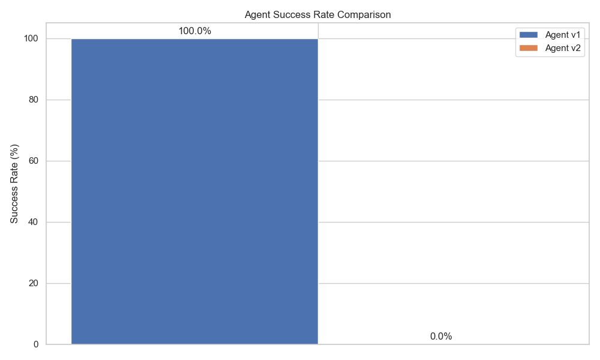
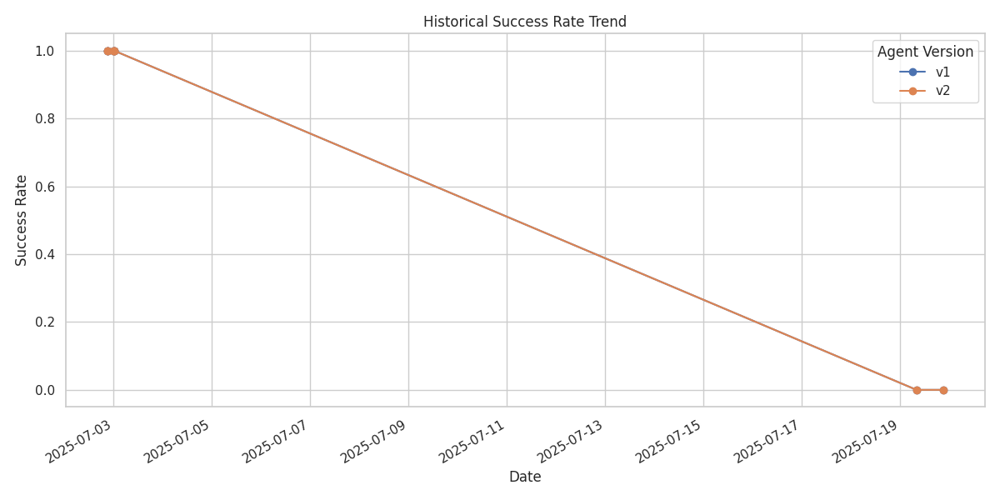
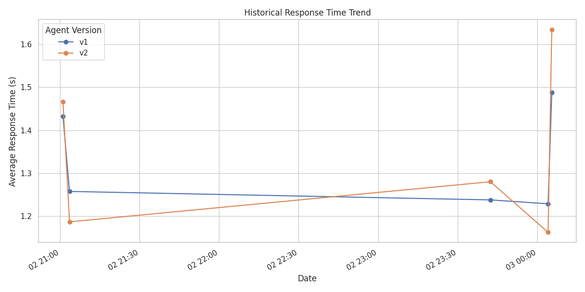

# GitHub Copilot Agent Evaluation Report

Generated at: 2025-07-19T21:00:33.786671

## 📊 Summary

| Metric | Value |
|--------|-------|
| Total Instructions | 5 |
| Agent v1 Success Rate | 0.0% (0/5) |
| Agent v2 Success Rate | 0.0% (0/5) |
| Improvement | +0.0% points |

## 📈 Success Rate Comparison



## 📊 Metrics Comparison

### Average Metrics
| Metric | Agent v1 | Agent v2 | Difference |
|--------|----------|----------|------------|
| jaccard_similarity | 0.000 | 0.000 | +0.000 |
| bleu_score | 0.000 | 0.000 | +0.000 |
| rouge_1 | 0.000 | 0.000 | +0.000 |
| rouge_2 | 0.000 | 0.000 | +0.000 |
| rouge_l | 0.000 | 0.000 | +0.000 |
| response_time (s) | 0.000 | 0.000 | +0.000 |


## 📉 Historical Trend Analysis





## 📋 Detailed Results

<details><summary>Click to expand detailed results</summary>

| ID | Type | Difficulty | v1 Success | v2 Success | v1 Jaccard | v2 Jaccard | v1 BLEU | v2 BLEU | v1 ROUGE-L | v2 ROUGE-L | v1 Time (s) | v2 Time (s) |
|----|------|------------|------------|------------|------------|------------|---------|---------|------------|------------|-------------|-------------|
| bug_fix_1 | bug_fix | hard | ❌ | ❌ | 0.000 | 0.000 | 0.000 | 0.000 | 0.000 | 0.000 | 0.00 | 0.00 |
| code_review_1 | code_review | medium | ❌ | ❌ | 0.000 | 0.000 | 0.000 | 0.000 | 0.000 | 0.000 | 0.00 | 0.00 |
| pr_creation_1 | pr_creation | easy | ❌ | ❌ | 0.000 | 0.000 | 0.000 | 0.000 | 0.000 | 0.000 | 0.00 | 0.00 |
| refactor_1 | refactoring | easy | ❌ | ❌ | 0.000 | 0.000 | 0.000 | 0.000 | 0.000 | 0.000 | 0.00 | 0.00 |
| test_case_1 | test_creation | medium | ❌ | ❌ | 0.000 | 0.000 | 0.000 | 0.000 | 0.000 | 0.000 | 0.00 | 0.00 |
</details>

## ⚙️ Configuration

<details><summary>Click to view evaluation configuration</summary>

```json
{
  "agent_v1_endpoint": "http://agent-v1.example.com/api/v1/complete",
  "agent_v2_endpoint": "http://agent-v2.example.com/api/v1/complete",
  "agent_v2_model": null,
  "api_key_v1": "***REDACTED***",
  "api_key_v2": "***REDACTED***",
  "instructions_file": "instructions.json",
  "results_dir": "results",
  "timeout": 60,
  "max_retries": 3,
  "retry_delay": 5,
  "demo_mode": false
}
```
</details>
