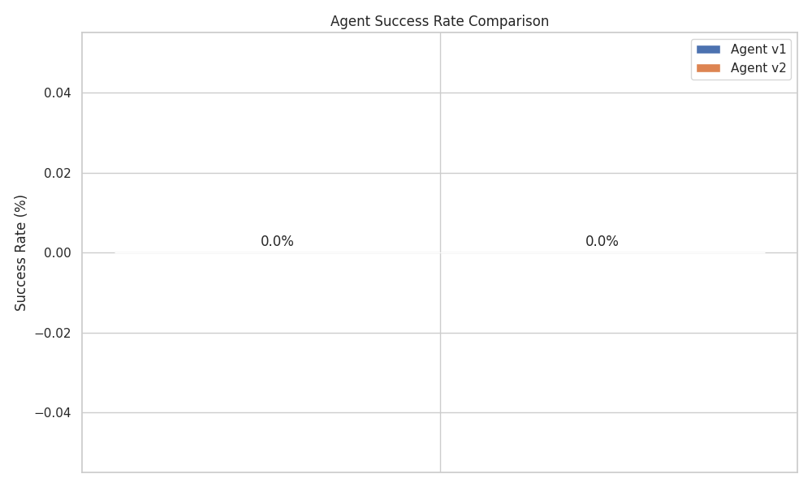
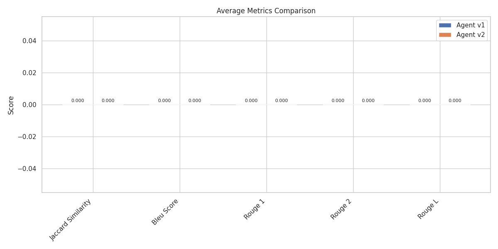

# GitHub Copilot Agent Evaluation Report

Generated at: 2025-07-03T00:05:45.998829

## 📊 Summary

| Metric | Value |
|--------|-------|
| Total Instructions | 5 |
| Agent v1 Success Rate | 100.0% (5/5) |
| Agent v2 Success Rate | 100.0% (5/5) |
| Improvement | +0.0% points |

## 📈 Success Rate Comparison



## 📊 Metrics Comparison

### Average Metrics
| Metric | Agent v1 | Agent v2 | Difference |
|--------|----------|----------|------------|
| jaccard_similarity | 0.085 | 0.075 | -0.010 |
| bleu_score | 0.019 | 0.015 | -0.004 |
| rouge_1 | 0.161 | 0.143 | -0.018 |
| rouge_2 | 0.022 | 0.018 | -0.004 |
| rouge_l | 0.147 | 0.132 | -0.015 |
| response_time (s) | 1.431 | 1.633 | +0.202 |



## 📉 Historical Trend Analysis


## 📋 Detailed Results

<details><summary>Click to expand detailed results</summary>

| ID | Type | Difficulty | v1 Success | v2 Success | v1 Jaccard | v2 Jaccard | v1 BLEU | v2 BLEU | v1 ROUGE-L | v2 ROUGE-L | v1 Time (s) | v2 Time (s) |
|----|------|------------|------------|------------|------------|------------|---------|---------|------------|------------|-------------|-------------|
| bug_fix_1 | bug_fix | hard | ✅ | ✅ | 0.032 | 0.026 | 0.013 | 0.011 | 0.062 | 0.051 | 1.80 | 1.78 |
| code_review_1 | code_review | medium | ✅ | ✅ | 0.152 | 0.125 | 0.035 | 0.026 | 0.300 | 0.255 | 1.59 | 1.74 |
| pr_creation_1 | pr_creation | easy | ✅ | ✅ | 0.167 | 0.167 | 0.029 | 0.024 | 0.235 | 0.244 | 1.33 | 1.40 |
| refactor_1 | refactoring | easy | ✅ | ✅ | 0.074 | 0.059 | 0.019 | 0.013 | 0.138 | 0.111 | 1.21 | 1.60 |
| test_case_1 | test_creation | medium | ✅ | ✅ | 0.000 | 0.000 | 0.000 | 0.000 | 0.000 | 0.000 | 1.22 | 1.64 |
</details>

## ⚙️ Configuration

<details><summary>Click to view evaluation configuration</summary>

```json
{
  "agent_v1_endpoint": null,
  "agent_v2_endpoint": null,
  "agent_v2_model": null,
  "api_key_v1": "***REDACTED***",
  "api_key_v2": "***REDACTED***",
  "instructions_file": "instructions.json",
  "results_dir": "results",
  "timeout": 60,
  "max_retries": 3,
  "retry_delay": 5,
  "demo_mode": true
}
```
</details>
